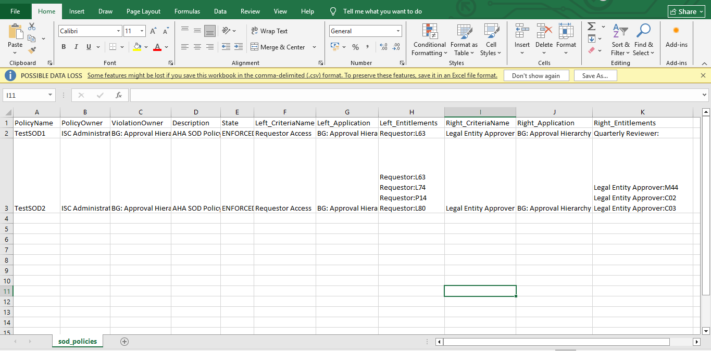
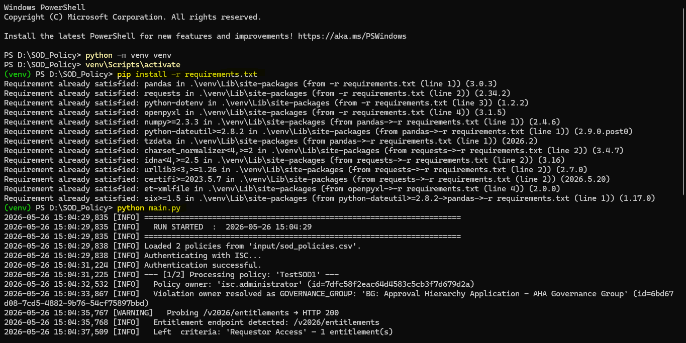

# SOD Policy Migration Tool

This tool reads a list of Segregation of Duties (SOD) policies from a spreadsheet and automatically creates or updates them in SailPoint Identity Security Cloud (ISC). You do not need to create each policy manually.

---

## What You Need Before Starting

1. **Python 3.8 or higher** installed on your machine
   - Check by opening Command Prompt and typing: `python --version`
   - If not installed, download from: https://www.python.org/downloads/
   - During installation, make sure to check **"Add Python to PATH"**

2. **Your ISC tenant credentials** — you need:
   - Tenant Base URL (e.g. `https://yourcompany.api.identitynow.com`)
   - Client ID
   - Client Secret
   - *(Get these from your ISC admin or API credentials page)*

---

## Step 1 — Fill In Your Credentials

Open the `.env` file in Notepad and fill in your details:

```
BASE_URL=https://yourcompany.api.identitynow.com
CLIENT_ID=your-client-id-here
CLIENT_SECRET=your-client-secret-here
```

> **Note:** If you cannot see the `.env` file in File Explorer, go to **View → Show → Hidden items** and check the box.

Save and close the file.

---

## Step 2 — First-Time Setup (Run Once Only)

Open **Command Prompt** in the `SOD_Policy` folder:
- Hold **Shift**, right-click inside the folder, and select **"Open PowerShell window here"** or **"Open Command window here"**

Run the following commands one by one:

```
python -m venv venv
venv\Scripts\activate
pip install -r requirements.txt
```

You should see packages being installed. This only needs to be done once.

---

## Step 3 — Prepare Your Input CSV

Open `input/sod_policies.csv` in **Microsoft Excel**.

Each row is one SOD policy. Fill in the following columns:



### How to Enter Multiple Entitlements in One Cell (Excel)

If a policy has more than one entitlement on a side, press **Alt + Enter** inside the cell to go to the next line:

```
Requestor:L63       ← press Alt+Enter here
Requestor:L74       ← press Alt+Enter here
Requestor:P14       ← press Alt+Enter here
Requestor:L80
```

> **Important:** Save the file as **CSV UTF-8** format (not regular CSV):
> File → Save As → choose **CSV UTF-8 (Comma delimited) (*.csv)**
> Close the file before running the script.

---

## Step 4 — Run the Migration

Open Command Prompt in the `SOD_Policy` folder, activate the environment and run:

```
venv\Scripts\activate
python main.py
```

You will see progress printed on screen as each policy is processed.



---

## Step 5 — Check the Results

After the script finishes, check these files:

### `output/migration_results.csv`
Open in Excel. Every policy will have one of these statuses:

| Status | Meaning |
|---|---|
| **SUCCESS** | Policy was created successfully in ISC |
| **UPDATED** | Policy already existed and was updated with new data from the CSV |
| **SKIPPED** | Policy already existed and had no changes — nothing was done |
| **SKIPPED** | A required field was missing or invalid — check the **Error** column for the exact field name and row number (e.g. `missing/empty field 'State'`) |
| **FAILED** | The ISC API rejected the request — check the Error column for details |
| **ERROR** | Something unexpected went wrong — check the Error column for details |

### `logs/summary.log`
Open in Notepad. Shows a summary block for every run:
```
Run     : 2026-05-26 01:00:00
Total   : 10  |  Created: 8  |  Updated: 1  |  Failed: 1  |  Skipped: 0
```

### `logs/migration.log`
Open in Notepad. Shows the full detail of every step — useful if you need to investigate a failure.

---

## Re-Running the Script

You can safely re-run the script on the same file at any time:

- Policies that **already exist and have not changed** → `SKIPPED` (nothing happens)
- Policies that **already exist but you changed something** in the CSV → `UPDATED`
- Policies that **failed last time** and you have now fixed the data → will be retried and created

---

## Common Issues

**"python is not recognized"**
Python is not installed or not added to PATH. Re-install Python and check "Add Python to PATH" during setup.

**"No module named dotenv" or similar**
You skipped Step 2 or the environment is not activated. Run `venv\Scripts\activate` first, then `pip install -r requirements.txt`.

**Policy shows ERROR — Identity not found: 'John Smith'**
The name in `PolicyOwner` or `ViolationOwner` does not exactly match the display name in ISC. Check spelling and capitalisation.

**Policy shows ERROR — Entitlement not found: 'Requestor:L99'**
The entitlement name does not exist in ISC under that application. Check the exact entitlement name in ISC.

**Policy shows ERROR — Source not found: 'My App'**
The application name in `Left_Application` or `Right_Application` does not exactly match the source name in ISC.

**Policy shows ERROR — No working entitlement endpoint found**
The script tried all API versions and none responded. This usually means your ISC credentials do not have permission to access entitlements, or the tenant URL in `.env` is incorrect.

**Policy shows SKIPPED — missing/empty field 'State'**
A required column in that row is blank. Fill it in and re-run.

**".env file not found" or credentials error**
Make sure you filled in the `.env` file as described in Step 1 and that it is saved in the same folder as `main.py`.

**Violation owner warning in logs**
If you see `Governance group 'X' not found. Falling back to IDENTITY` in the logs, it means the name in `ViolationOwner` was not found as a governance group but was found as an identity. Verify this is the correct person or group name.

---

## Need Help?

If a policy keeps failing, share the `logs/migration.log` file with your ISC administrator — it contains the full error detail needed to diagnose the issue.
